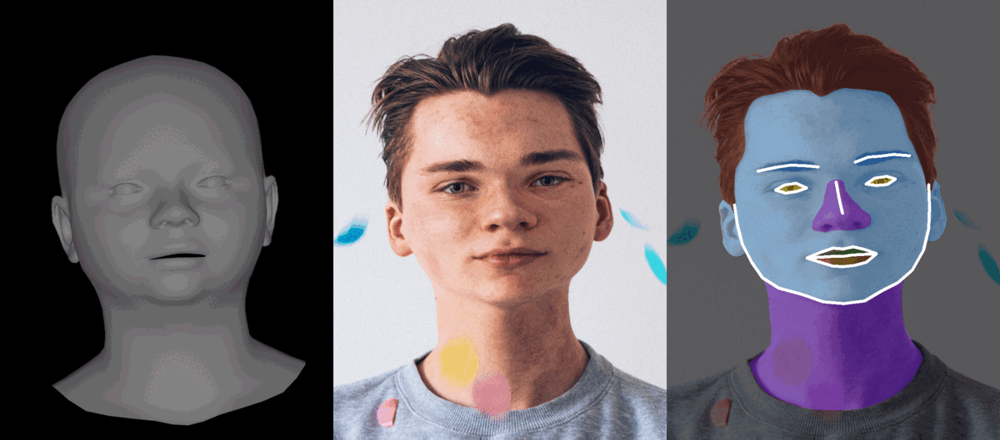

# Face Data Augmentation

This repository provides a face data augmentation technique by 3D geometric transformation.

<p align="center"> 

</p>

Geometric transformation performed by using [FLAME](http://flame.is.tue.mpg.de/) model. FLAME is a lightweight and expressive generic head model learned from over 33,000 of accurately aligned 3D scans. FLAME combines a linear identity shape space (trained from head scans of 3800 subjects) with an articulated neck, jaw, and eyeballs, pose-dependent corrective blendshapes, and additional global expression blendshapes.

### Requirements

1. **The FLAME model can be downloaded from the [FLAME project website](https://flame.is.tue.mpg.de). You need to sign up and agree to the license for access. Copy 'generic_model.pkl' to ./data folder.**
2. Python3
3. PyTorch
4. OpenCV
5. dlib
5. pyrender
6. trimesh

### Installation

```bash
git clone https://github.com/ainur699/face_data_augmentation.git
cd face_data_augmentation

pip install -r requirements.txt
```

### Demo
Generate geometric augmentations of face images from folder.You can add paths to facial landmarks or masks to apply the same transformations on them.
Run the following command from the terminal.

```
python main.py --source_dir ./images --mask_dir ./images/masks --landmarks_dir ./images/landmarks --dst_dir ./results --aug_num 10
```

## Notes
I use the FLAME.py from [FLAME_PyTorch](https://github.com/soubhiksanyal/FLAME_PyTorch).